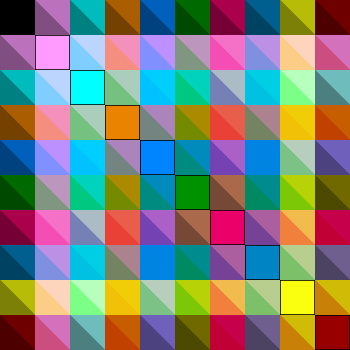

# ColorVectorSpace

[](https://travis-ci.org/JuliaGraphics/ColorVectorSpace.jl)
[](http://codecov.io/github/JuliaGraphics/ColorVectorSpace.jl?branch=master)

This package is an add-on to [ColorTypes](https://github.com/JuliaGraphics/ColorTypes.jl), and provides fast
mathematical operations for objects with types such as `RGB` and
`Gray`.

## Introduction

Colorspaces such as RGB, unlike XYZ, are technically non-linear; the
"colorimetrically correct" approach when averaging two RGBs is to
first convert each to XYZ, average them, and then convert back to RGB.

However, particularly in image processing it is common to ignore this
concern, and for the sake of performance treat an RGB as if it were a
3-vector.  This package provides such operations.

If you're curious about how much difference it makes, the following
diagram might help. The first 10 `distinguishable_colors` were
generated, and all pairs were averaged. Each box represents the
average of the pair of diagonal elements intersected by tracing
vertically and horizontally; within each box, the upper diagonal is
the "colorimetrically-correct" version, while the lower diagonal
represents the "RGB vector space" version.



## Usage

```jl
using ColorTypes, ColorVectorSpace
```

That's it. Just by loading `ColorVectorSpace`, most basic mathematical
operations will "just work" on `AbstractRGB`, `AbstractGray`
(`OpaqueColor{T,1}`), `TransparentRGB`, and `TransparentGray` objects.
(See definitions for the latter inside of `ColorTypes`).

If you discover missing operations, please open an issue, or better
yet submit a pull request.
